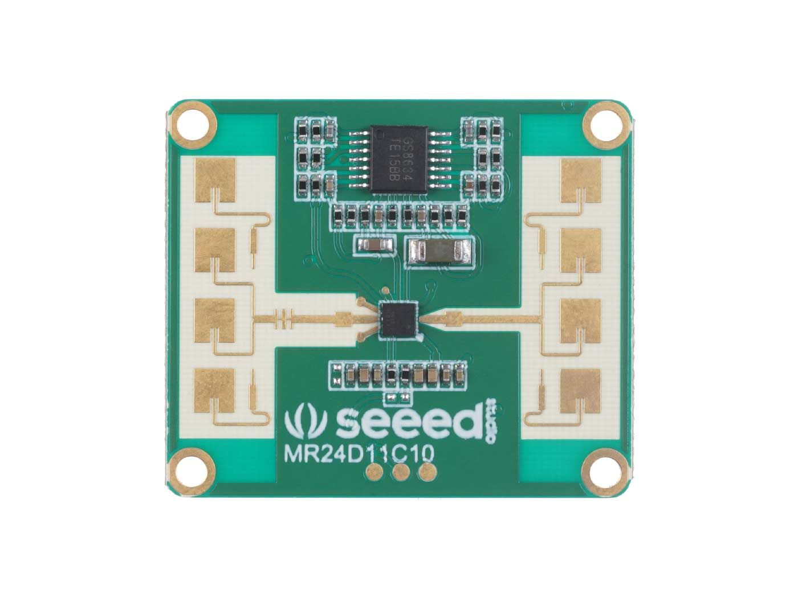

# Seeed MR24FDB1 Radar Module (Fall Detection & Presence Sensing) 📡🧍‍♂️

This repository provides a Python-based implementation for interfacing with the **Seeed Studio MR24FDB1** 24GHz mmWave radar sensor. It enables **real-time human presence monitoring**, **fall detection**, and radar **configuration commands** via serial communication — designed for use with **Raspberry Pi** or other Linux boards.



---

## 📦 What’s Inside

### `mr24fdb1_realtime.py`
- Continuously reads radar data via serial connection  
- Detects presence, motion, and fall states  
- Outputs fall alerts and environment status in real time  
- Optional GPIO pin control for alerts (e.g., LEDs, buzzers)  

### `mr24fdb1_configurator.py`
- Sends radar configuration commands (e.g., scene setup, fall sensitivity)  
- Customizable for different indoor applications like bathrooms or bedrooms  

### `mr24fdb1_utils.py`
- Encapsulates radar data processing logic and command structuring  
- Includes CRC16 checksum calculations and radar interpretation algorithms  

---

## 🚀 Features

- 🧠 Fall Detection (Suspected, Real, Warning levels)  
- 👤 Presence Detection (moving, static, away, close)  
- 🛠 Configurable operating scenes (bathroom, bedroom, office, etc.)  
- 🎯 Adjustable radar sensitivity and alert delays  
- 💡 Optional GPIO control (e.g., LEDs for alerts)  
- 🐍 Pure Python (no third-party dependencies required)  
- 🧪 Verified on Raspberry Pi 4 via UART (`/dev/ttyS0`)  

---

## 🔧 Setup & Usage

### Hardware Required

- Seeed Studio **MR24FDB1** Radar Module  
- Raspberry Pi (3/4) or equivalent  
- Optional: LEDs/Buzzer on GPIO pin 16  

### Wiring (Default Pinout)

- Radar TX → Pi RX (`/dev/ttyS0`)  
- Radar RX → Pi TX  
- 5V Power and GND  
- GPIO 16: Optional output for alert  

---

### 1️⃣ Configure Radar Settings (Optional)

```bash
python mr24fdb1_configurator.py
```

This will:
- Set the scene to bathroom (top-mounted)  
- Enable fall detection  
- Set fall sensitivity to high (level 10)  

---

### 2️⃣ Start Real-Time Monitoring

```bash
python mr24fdb1_realtime.py
```

**Output:**

```
............... Fall Detection Module is activated ...............
radar said somebody move
NO FALL
SUSPECTED FALL
```

---

## 🧠 Use Cases

- 🛁 Fall Detection in Bathrooms  
- 🛏️ Elderly Care in Bedrooms  
- 🧍‍♂️ Occupancy/Presence Monitoring  
- 🏠 Smart Home Automation Triggers  
- 💡 Lights or Alerts via GPIO  

---

## 📄 License

This project is licensed under the MIT License — feel free to use, modify, and share.

---

## 🌱 Credits

Developed for academic & prototyping purposes.  
Radar module: Seeed Studio MR24FDB1  

If this helps you, feel free to ⭐️ the repo or share with others!